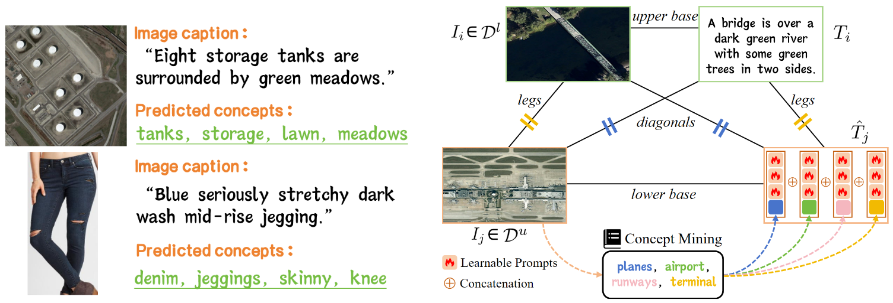

# [ICLR 2025] Semi-Supervised CLIP Adaptation by Enforcing Semantic and Trapezoidal Consistency

This is PyTorch implementation of [Semi-Supervised CLIP Adaptation by Enforcing Semantic and Trapezoidal Consistency](https://openreview.net/pdf?id=97D725GJtQ) at ICLR 2025.

## Abstract
Vision-language pre-training models, such as CLIP, have demonstrated strong capability in rapidly adapting to downstream tasks through fine-tuning, and have been widely applied across various tasks. However, when the downstream tasks are constrained by limited image-text paired data, CLIP struggles to effectively address the domain gap between the pre-training and the target tasks. To address this limitation, we propose a novel semi-supervised CLIP training method coined SEMICLIP that leverages a small amount of image-text pairs alongside a large volume of images without text descriptions to enhance CLIP’s cross-modal alignment. To effectively utilize unlabeled images, we introduce semantic concept mining to improve task-specific visual representations by matching images with relevant concepts mined from labeled data. Leveraging matched semantic concepts, we construct learnable surrogate captions for unlabeled images and optimize a trapezoidal consistency to regulate the geometric structure of image-text pairs in the representation space. Experimental results demonstrate that our approach significantly improves the adaptability of CLIP in target tasks with limited labeled data, achieving gains ranging from 1.72% – 6.58% for zero-shot classification accuracy and 2.32% – 3.23% for image-text retrieval performance on standard benchmarks.

## Method



## Environment

```
conda create -n semiclip python=3.7
conda activate semiclip
pip install -r requirements.txt
```

## Dataset

The directory structure for datasets looks like:

```
Path/To/Dataset
├─ aerial
│  ├─ RSICD
|  ├─ UCM_captions
|  ├─ Sydney_captions
│  ├─......
├─ fashion
│  ├─ fashion200k
│  ├─ FashionGen
│  └─ PolyvoreOutfits
└─ ......
```

## Start Training

Train our proposed SemiCLIP for different settings.

For remote sensing datasets

```
# For supervised pre-training
bash scripts/train_rs_stage1.sh

# For semi-supervised fine-tuning
bash scripts/train_rs_stage2.sh
```

For fashion datasets:

```
# For supervised pre-training
bash scripts/train_fashion_stage1.sh

# For semi-supervised fine-tuning
bash scripts/train_fashion_stage2.sh
```
## Acknowledgement
Our code of SemiCLIP is based on the implementation of S-CLIP. We thank the authors of the [S-CLIP](https://github.com/alinlab/s-clip) for making their code available to the public.